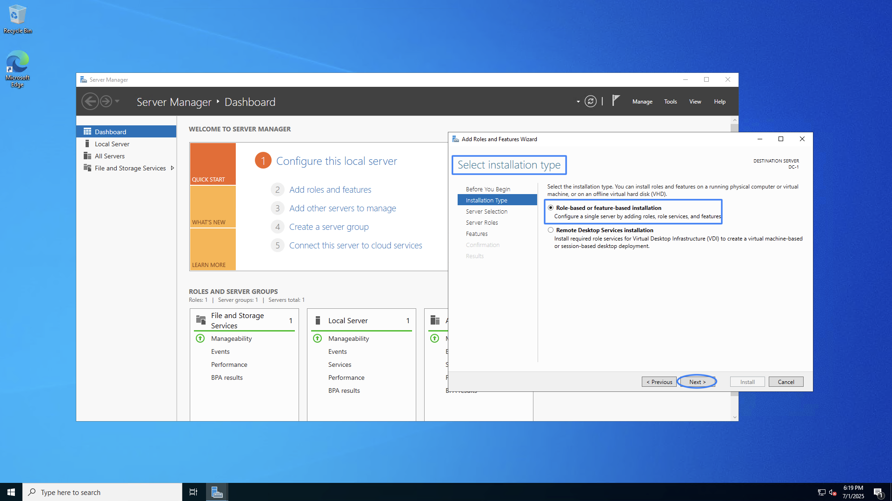
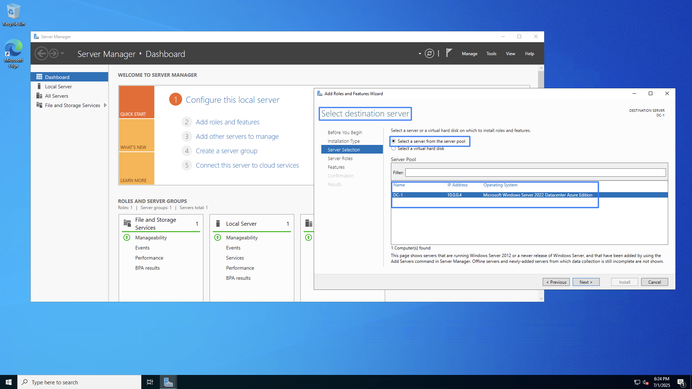
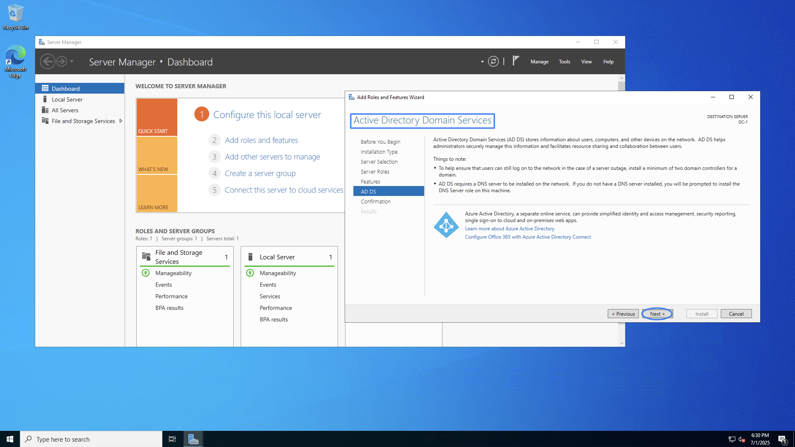

# Active Directory Lab – Azure Infrastructure & AD DS Setup

<strong>By: Isiah Blake</strong>

---

## 📘 Project Summary

This project is a walkthrough of building a basic Active Directory infrastructure using **Microsoft Azure**, showcasing how a help desk or system administrator might deploy and configure foundational networking tools.

This setup includes:
- A **Domain Controller (DC-1)** on Windows Server 2022
- A **Client machine (Client-1)** running Windows 10
- A Virtual Network with custom **DNS configuration**
- Verification using `ping` and `ipconfig /all`

---

## 🖥️ Environments Used
- Microsoft Azure
- Windows Server 2022
- Windows 10 (Client VM)

---

## ⚙️ Technologies & Tools
- Azure Resource Group & Virtual Network
- Static IP configuration
- Custom DNS configuration
- PowerShell / CMD commands
- Windows Firewall
- Network Testing tools (`ping`, `ipconfig`)

---

## 💻 Languages Used
- PowerShell (for command execution and diagnostics)

---

## 🧠 Key Skills Demonstrated
- Provisioning VMs in Microsoft Azure
- Assigning static IP addresses to VMs
- Configuring DNS on client machines
- Disabling Windows Firewall for testing
- Installing Active Directory Domain Services (AD DS)
- Promoting a server to Domain Controller
- Testing connectivity and DNS resolution

---

## 🖼️ Media – Screenshots

### 🔹 Azure Dashboard  
> Overview of the Microsoft Azure dashboard showing resources in the subscription.  

---

### 🔹 Resource Group  
> Resource group that contains all lab components including VMs and virtual network.  

---

### 🔹 Virtual Machines Running  
> VM instances: DC-1 (Windows Server 2022) and Client-1 (Windows 10) deployed and running.  

---

### 🔹 DC-1 Static IP Configuration  
> Static IP set on DC-1’s NIC to ensure domain controller has a fixed internal IP.  

---

### 🔹 Client-1 DNS Settings  
> DNS settings on Client-1 pointing to the domain controller’s static private IP.  

---

### 🔹 DC-1 Firewall Disabled  
> Windows Firewall disabled on DC-1 to allow pings and domain traffic.  

---

### 🔹 Server Manager  
> Server Manager open on DC-1 before role installation begins.  

---

### 🔹 Add Roles and Features Wizard  
> Wizard launched to install Active Directory Domain Services (AD DS).  

---

### 🔹 Installation Type: Role-Based  
> “Role-based or feature-based installation” selected.  

---

### 🔹 Server Selection  
> DC-1 selected as the server for the AD DS role installation.  

---

### 🔹 Server Roles: AD DS Checked  
> AD DS (Active Directory Domain Services) role selected.  

---

### 🔹 AD DS Installed Sidebar  
> Sidebar confirms AD DS was successfully added to DC-1.  

---

### 🔹 Auto-Restart Checked  
> Automatic restart option selected in case it’s required during the role install.  

---

### 🔹 Installation Success  
> Final confirmation showing the AD DS role installation succeeded.  

---

## 📌 Summary

This project demonstrates an entry-level implementation of an Active Directory infrastructure deployed on Microsoft Azure Virtual Machines. The process covers VM deployment, networking configuration, DNS setup, AD DS installation, and basic troubleshooting—skills relevant for IT support and systems administration roles.

---
📅 Completed: July 1, 2025
## 🔗 Credits

Course: [CourseCareers IT Support](https://coursecareers.com)                                                                                                                                                                                
